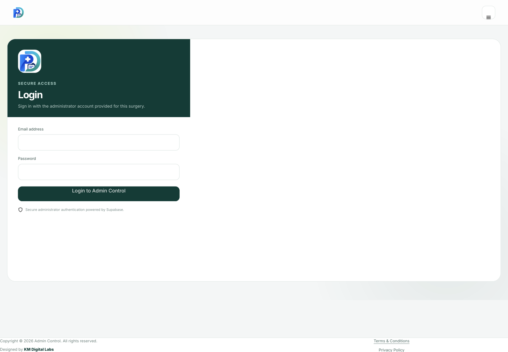

# Patient Desk



Patient Desk is a surgery patient-administration web app with Supabase Auth, multi-surgery Row Level Security, and browser-side encrypted patient content.

## Repository structure

```text
Patient-Desk-GitHub-Repo/
├── index.html
├── css/
│   └── styles.css
├── js/
│   ├── app.js
│   ├── config.js
│   └── config.example.js
├── assets/
│   └── patient-desk-logo.jpg
├── sql/
│   ├── 00_full_recovery.sql
│   ├── 01_base_schema.sql
│   ├── 02_e2ee_migration.sql
│   ├── 03_restore_encrypted_backup.sql
│   ├── 04_bootstrap_new_practice.sql
│   └── 05_verify_installation.sql
└── docs/
    ├── screenshot.png
    └── SUPABASE_RECOVERY.md
```

## Run locally

Because the app uses browser APIs and external Supabase/jsPDF libraries, serve the repository over HTTP rather than opening `index.html` directly:

```bash
python -m http.server 8080
```

Then open `http://localhost:8080`.

## Switch to another Supabase project

1. Create the new Supabase project.
2. Run `sql/00_full_recovery.sql` in the new project's SQL Editor.
3. Create the administrator under **Authentication → Users**.
4. For a brand-new empty surgery, run `sql/04_bootstrap_new_practice.sql`.
5. For an existing encrypted surgery, use `sql/03_restore_encrypted_backup.sql` with the encrypted backup instead. **It preserves the original practice UUID and record UUIDs, which are required by AES-GCM AAD.**
6. Copy the new project URL and publishable key into `js/config.js`. Never use the service-role key in browser code.
7. Run `sql/05_verify_installation.sql`.
8. Deploy.

## Encryption recovery requirement

The database backup contains ciphertext and the wrapped data-encryption key, but not the surgery passphrase. To decrypt restored data, the surgery must still know the **same encryption passphrase** used before the account switch. KM Digital Labs or Supabase cannot derive it from the database.

## GitHub Pages

This repository is static and can be hosted directly with GitHub Pages. Set the Pages source to the repository's default branch/root. `index.html` already references `css/styles.css`, `js/config.js`, and `js/app.js` with relative paths.

## Security

- Supabase browser client uses only the publishable key.
- RLS is the tenant security boundary.
- Patient payloads use client-side AES-256-GCM.
- The surgery DEK is wrapped using a PBKDF2-SHA256-derived key.
- File-number uniqueness uses a keyed blind index.
- Do not commit service-role keys, database passwords, or surgery encryption passphrases.

Designed by KM Digital Labs.
